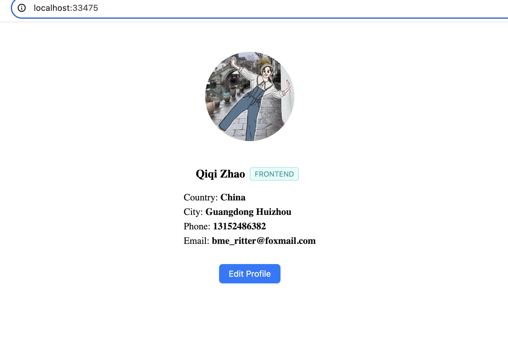

# Run in local

### frontend
`npm run dev`

endpoint: [http://localhost:33475/](http://localhost:33475/)

### backend

database:

`docker run -d --name mongo -p 27017:27017 mongo:latest`

service:

`npm run start:backend`

endpoint: [http://localhost:3001](http://localhost:3001)

### Preview

no data: **if no data you need click create user button first**

chrome:

iphone se:

